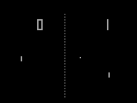
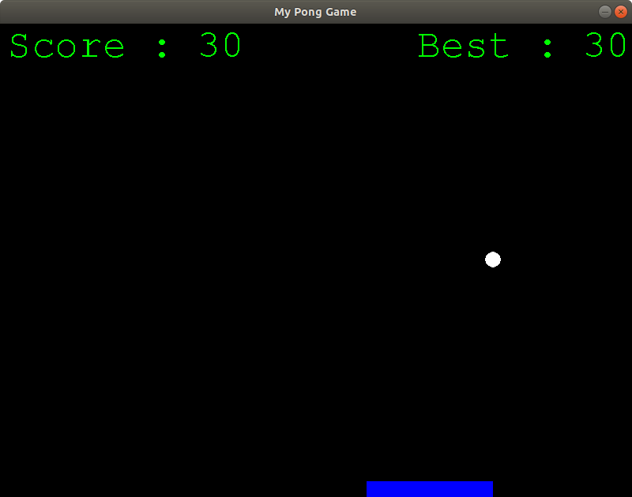
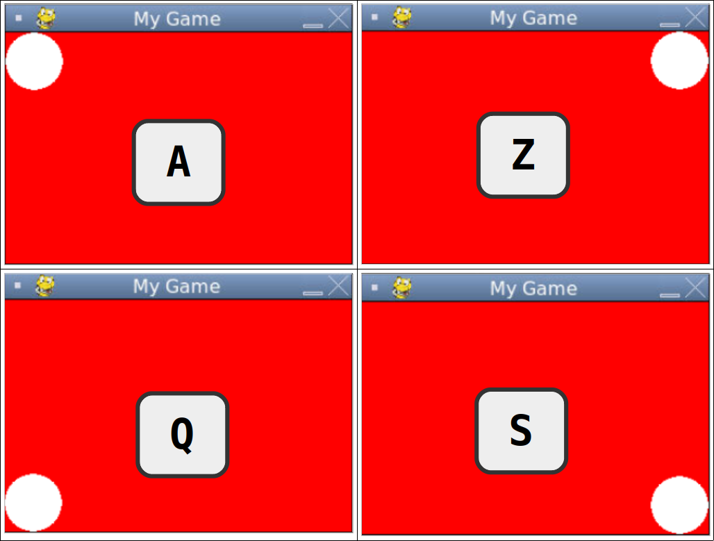
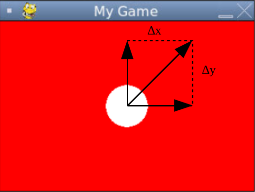

# Pong

> **Pong** est un des premiers jeux vidéo d’arcade et le premier jeu vidéo d’arcade de sport. Il a été imaginé par l’Américain **Nolan Bushnell** et développé par **Allan Alcorn**, et la société **Atari** le commercialise à partir de novembre 1972. Bien que d’autres jeux vidéo aient été inventés précédemment, comme **Computer Space**, **Pong** est le premier à devenir populaire.
> 
> Le jeu est inspiré du tennis de table en vue de dessus, et chaque 
> joueur s’affronte en déplaçant la raquette virtuelle de haut en bas, via
>  un bouton rotatif, de façon à garder la balle dans le terrain de jeu. 
> Le joueur peut changer la direction de la balle en fonction de l’endroit
>  où celle-ci tape sur la raquette, alors que sa vitesse augmente 
> graduellement au cours de la manche. Un score est affiché pour la partie
>  en cours et des bruitages accompagnent la frappe de la balle sur les 
> raquettes.
> 
> Pong est à l’origine un exercice demandé par Bushnell à Alcorn en 
> guise d’entraînement. Une version similaire a été créée précédemment par
>  **Ralph Baer** pour la console de jeu **Odyssey** de **Magnavox**, mais son existence reste peu connue. Surpris par la qualité du résultat, **Bushnell** et **Ted Dabney**, fondateurs **d’Atari**,
>  décident de commercialiser le jeu dès 1972. La copie du concept 
> entraîne d’ailleurs une poursuite en justice de Magnavox contre Atari 
> pour violation de brevet en 1976.
> 
> Mise sur le marché fin 1972, la borne d’arcade est un succès : elle 
> est vendue à près de 8 000 exemplaires l’année suivante et engrange 
> jusqu’à 40 millions de dollars de chiffres d’affaires en 1975, dépassant
>  toutes les prédictions de **Bushnell** et **Dabney**.
>  Ce succès incite de nombreuses sociétés à se lancer dans le jeu vidéo 
> en copiant le concept, notamment sur console de salon. À la suite des 
> bons chiffres de la borne d’arcade et de l’engouement généré par les 
> concurrents pour le jeu de salon, **Pong** est porté sur une console de salon dédiée, sous le nom **Home Pong** à partir de 1975, commercialisée par **Sears** puis directement par **Atari** un an après. Ce double succès est considéré comme l’évènement 
> précurseur de l’industrie du jeu vidéo, avec une forte augmentation de 
> l’offre, des centaines de consoles de salon reprenant le concept.

*<https://fr.wikipedia.org/wiki/Pong>*

 
# Objectif

Notre objectif est de développer une version Python de ce jeu en 
s’appuyant sur les concepts de programmation que nous avons appris 
jusqu’à maintenant :

- Utilisation de modules

- les fonctions

- les dictionnaires

- les tests conditionnels

- les boucles

Notre jeu se limitera à un joueur unique. Cette version du jeu est connue sous le nom ***Pong Survivor*** ou ***Single Player Pong***

Le développement du jeu est basé sur l’utilisation de la bibliothèque **Pygame**




# Le jeu

## Pygame

### Qu’est ce que c’est ?

> **Pygame** est une bibliothèque libre multiplate-forme 
> qui facilite le développement de jeux vidéo temps réel avec le langage 
> de programmation Python.
> 
> Elle est distribuée selon les termes de la licence **GNU LGPL**.
> 
> Construite sur la bibliothèque [SDL](https://fr.wikipedia.org/wiki/Simple_DirectMedia_Layer),
>  elle permet de programmer la partie multimédia (graphismes, son et 
> entrées au clavier, à la souris ou au joystick), sans se heurter aux 
> difficultés des langages de bas niveaux comme le **C** et 
> ses dérivés. Cela se fonde sur la supposition que la partie multimédia, 
> souvent la plus contraignante à programmer dans un tel jeu, est 
> suffisamment indépendante de la logique même du jeu pour qu’on puisse 
> utiliser un langage de haut niveau (en l’occurrence le Python) pour la 
> structure du jeu.
> 
> Pygame, en plus d’adapter la [SDL](https://fr.wikipedia.org/wiki/Simple_DirectMedia_Layer) au Python, fournit également un petit nombre de fonctions spécifiques au développement de jeux.
> 
> On peut aussi remarquer que Pygame n’est plus utilisée exclusivement 
> pour des jeux vidéo, mais également pour des applications diverses 
> nécessitant du graphisme.

— wikipedia <https://fr.wikipedia.org/wiki/Curses>

### Utilisation basic de Pygame

Les méthodes principales sont très simples :

- `init()` initialise le module Pygame.
- `display` module qui permet de gérer l’affichage de la fenêtre de jeu
- `display.set_mode(largeur, hauteur)` initialisation de la fenêtre de jeu
- `display.set_caption(title)` Titre de la fenêtre de jeu
- `display.update()` met à jour la fenêtre de jeu
- `draw` module qui permet de dessiner des formes élémentaires
- `draw.circle(screen, color, (x, y), r)` dessiner un cercle dans la 
fenêtre `screen` de rayon `r` à la position `x, y` pour son centre 
et rempli de couleur `color`
- `draw.rect(screen, color, (x, y, w, h)` dessiner un rectangle dans 
la fenêtre `screen` de largeur `w`, de hauteur `h` à la 
position `x, y` pour le coin supérieur gauche et rempli de couleur `color`
`fill(couleur)` remplissage d’une surface avec une couleur
- `event.get()` Fourni les événements pour le contrôle du jeu 

[Documentation officielle de Pygame : https://www.pygame.org/docs/](https://www.pygame.org/docs/)

### Codage d’une fenêtre de jeu

1. ![Q] Créer le fichier `pong1.py` avec le code suivant :


```python
import pygame

pygame.init()

WIDTH = 300
HEIGHT = 200
screen = pygame.display.set_mode((WIDTH, HEIGHT))

pygame.display.set_caption('My Game')

WHITE = (255, 255, 255)
BLACK = (0, 0, 0)
RED = (255, 0, 0)
GREEN = (0, 255, 0)
BLUE = (0, 0, 255)
YELLOW = (255, 255, 255)

screen.fill(RED)
pygame.display.update()

end = False
while not end:
    for event in pygame.event.get():
        if event.type == pygame.QUIT:
            end = True

pygame.quit()
```

Le jeu est contenu dans une boucle qui s’achève lorsque le booléen `end`
 est vrai, ce qui arrivera lorsque le joueur cliquera sur la croix de 
 fermeture de la fenêtre (événement `QUIT`).


- Modifiez le programme pour que la fenêtre ait pour dimensions **600x400**

- Modifiez le titre de la fenêtre : ***"My Single Player Pong"***

- Changez la couleur du fond en noir

## Ajouter une forme

Pygame permet de dessiner des formes élémentaires comme des rectangles, des cercles, …​

Nous allons maintenant dessiner un cercle qui servira plus tard à la représentation de la balle :

- Créer le fichier `pong2.py`

- Ajouter un cercle rempli de couleur blanche de rayon `radius`, en plein centre de la fenêtre de jeu.

```
RADIUS = 25
pygame.draw.circle(___, ___, (___, ___), ___)
```

## Gérer les événements

Le contrôle du jeu est assuré par les touches de direction LEFT, RIGHT 
et Escape pour quitter la partie en cours. On ajoute généralement une 
touche pour  assurer la mise en pause du jeu. Ce rôle est souvent 
attribué à la touche SPACE.

On utilisera également la touche ENTER pour reprendre la partie.

Commençons par découvrir comment acquérir et gérer les événements 
liés à l’utilisation des touches

### Gestion des touches du clavier

Le type d’événement créé lorsque l’on appuie sur une touche est 
`KEYDOWN`, (ou `KEYUP` au relâchement de la touche).

Le module `pygame` possèdent des constantes sous la forme
 `K_touche` qui identifie toutes les touches du clavier.

Quelques exemples : `K_a`, `K_0`, `K_UP` etc...
<https://www.pygame.org/docs/ref/key.html>

Le module `key` possède une méthode `get_pressed()` qui fourni un 
tableau de valeurs à `0` pour une touche non appuyée et `1` pour une 
touche appuyée.

```python
key = pygame.key.get_pressed()
if key[pygame.K_a]:
    print("Touche 'a' pressée !")
``` 

1. ![Q] Créer le fichier `pong3.py` et codez l’utilisation des touches 
a, z, q et s pour déplacer le cercle dans la fenêtre de jeu comme
ci-dessous :




> Pygame gère l'affichage avec un double tampon (double buffer). 
> Quand nous avons fini de dessiner, nous faisons appel à la fonction 
> `pygame.display.flip()`. Ceci fait que tout ce que nous avons dessiné
> sur la Surface screen devient visible. Cette mise en tampon fait que 
> nous sommes sûrs de voir des images complètes dessinée à l'écran. 
> Sans cette manipulation par tampon, l'utilisateur verrait l'image se 
> dessiner au fur et à mesure sur son écran.

<https://fr.wikibooks.org/wiki/Pygame/Introduction_%C3%A0_Pygame#Un_avant-go%C3%BBt>

### Déplacement d’un objet

Comme nous venons de le voir, déplacer le cercle revient à calculer 
les coordonnées $`(x, y)`$ de son centre. 
Nous pouvons donc recalculer ses coordonnées à chaque itération de 
la boucle, effacer l’écran, redessiner le cercle à la nouvelle position, 
rafraîchir la fenêtre de jeu et attendre (un peu) avant de recommencer :


Les variations de positions sur les axes $`x`$
 et $`y`$ sont nommées dans le schéma ci-dessous : 
 $`Δx`$
 et $`Δy`$
 





 La durée de la boucle est définie par la durée des actions à exécuter 
 et à l’attente qu’on lui imposera avant de recommencer.
 Cette attente est obtenue par l’utilisation de la méthode `delay(ms)` 
 du module `time` de `Pygame`. 

- un déplacement $`Δx`$ sur l’axe 
$`x`$ pendant un temps 
$`Δt`$ se fait à la vitesse 
$`v_x = \frac{Δx}{Δt}`$


- un déplacement $`Δy`$ sur l’axe 
$`y`$ pendant un temps 
$`Δt`$ se fait à la vitesse 
$`v_y = \frac{Δy}{Δt}`$

Si l’on choisit de déplacer identiquement sur les deux axes notre cercle, 
les quantités `Δx` et `Δy` sont égales.

Comme la durée d’une itération de boucle est fixée, la vitesse ne dépend 
que de cette quantité.
On peut donc établir les nouvelles coordonnées du centre du cercle comme suit :

- $`x_{i+1}=x_i \pm speed`$

- $`y_{i+1}=y_i \pm speed`$

- avec speed=Δx=Δy

Le sens de déplacement est matérialisé par l’opérateur $`\pm`$. 
On réalise cette opération de la façon suivante :

- $`sens=1`$ : déplacement dans le sens croissant (vers le bas ou à droite)

- $`sens=−1`$ : déplacement dans le sens décroissant (vers le haut ou à gauche)

ce qui donne les équations :

* $`x_{i+1} = x_i + sens_x \times speed`$
* $`y_{i+1} = y_i + sens_x \times speed`$


1. ![Q] Réaliser le programme `pong4.py` pour que le cercle puisse se 
déplacer manuellement comme précédemment et en utilisant également 
les touches UP, DOWN, RIGHT et LEFT pour générer des déplacements fins. 

1. ![Q] Modifier le code pour ne pas dépasser les bords.

1. ![Q] Complétez le code pour que le cercle puisse se déplacer 
automatiquement lorsque l’on a utilisé la touche o 
(**O** comme **Automatique** !) et manuellement lorsqu’on utilise la 
touche m (**M** comme **Manuel** !)

**Attention :** Il faudra gérer les rebonds sur les bords !

Un exemple de structure de code possible :

```python
speed = 1
sens_x = sens_y = 1
auto = True
end = False

while not end:
    SCREEN.fill(RED)
    for event in pygame.event.get():
        if event.type == pygame.QUIT:
            end = True

    key = pygame.key.get_pressed()

    if key[pygame.K_o]:
        auto = ...
    if key[pygame.K_m]:
        auto = ...   
    if not auto:
        # Manual mode :
        #  - use A, Z, Q, S to move circle on the corners
        #  - use UP, DOWN, LEFT, RIGHT to move circle by <speed> pixel
        ...

    else:
        # if the circle touches the right and left edges
        # reverse direction on x-axis
        if ...:
            x_sens = ...        # if the circle touches the lower and upper edges
        # reverse direction on y-axis
        if ...:
            y_sens = ...        # compute new coordonates
        x = x + ...
        y = y + ...
    pygame.draw.circle(SCREEN, WHITE, (x, y), radius)

    pygame.display.update()

    # wait before trying it again
    pygame.time.delay(10)

pygame.quit()
```

## Première version

### Le jeu brut

On sait maintenant :

- Créer une fenêtre de jeu

- Dessiner une forme

- Contrôler les déplacements

Il ne nous reste plus qu’à dessiner une raquette (un simple rectangle), gérer des déplacements et les collisions avec la balle. Si la balle ne touche pas la raquette lorsqu’elle est en bas, le jeu s’arrête.


1. ![Q] En vous inspirant du fichier `pong4.py`, créer le 
fichier `pong5.py` qui repond aux spécifications suivantes : 

    - fenêtre de jeu : Fond noir, dimensions 800*600
    - la balle est blanche et de rayon 10 pixels
    - les coordonnées de départ de la balle pour qu’elle tombe depuis le haut de l’écran au milieu
    - ajouter un rectangle de couleur bleu et de dimensions 200x20 centré 
        en bas de la fenêtre de jeu. Les caractéristiques de ce 
        rectangle seront rassemblées dans un dictionnaire :

            ```
            paddle = {}
            ```
    - ajoutez dans les contrôles du jeu un mode pause accessible avec la touche SPACE. La reprise du jeu se fait avec la touche ENTER
    - Ajoutez le contrôle de la raquette à l’aide des touches LEFT et RIGHT. La raquette ne doit pas sortir de la fenêtre de jeu.
    - Gérez les collisions avec les bords de gauche, du haut et de droite qui doivent occasionner un rebond.
    - Gérez les collisions avec la raquette qui doit également occasionner un rebond, sinon le jeu s’arrête.

### Améliorations

Le jeu fonctionne, mais il n’est pas très pratique :

- Il démarre dès l’exécution du programme : panique !

- On n’a pas d’indicateur de réussite

Il nous faut donc ajouter du texte pour :

- Retarder le démarrage de la partie avec un décompte par exemple : **3…​ 2…​ 1…​ 0** secondes.

- Afficher un score qui pourrait être défini comme le nombre de balles sauvées.

1. ![Q] Écrire et modifier le code ci-dessous dans un fichier `pong6.py`

    ~~~python
    import pygame
    pygame.init()

    ...

    myfont = pygame.font.SysFont('monospace', 50)

    print("pong6")
    screen.fill(BLACK)
    title = myfont.render("Single Player Pong:", False, GREEN)
    screen.blit(title, 
                (WIDTH // 2 - title.get_width() // 2,
                HEIGHT // 2 - title.get_height() * 2))
    pygame.display.update()
    pygame.time.delay(1000)

    # countdown before start game
    # loop from 3 to 0 and write the number in the middle of the screen

    # a faire

    pause = False
    end = False
    while not end:
        screen.fill(BLACK)
        # Control the game
        # Past your code from pong5.py

        pygame.draw.circle(screen, WHITE, (x, y), radius)
        pygame.draw.rect(screen,
                         paddle["color"],
                         (paddle["x"],
                          paddle["y"],
                          paddle["width"],
                          paddle["height"])
                        )

        # Display the score in position (10, 0) (top left on the screen)

        pygame.display.update()
        pygame.time.delay(10)

    # Wait a bit to be sure the player knows his score
    pygame.time.delay(2000)
    pygame.quit()
    ~~~


- Observez l’utilisation des méthodes :
  
  - `SysFont()` du module `font`
  
  - `render()` de l’objet `myfont`
  
  - `blit()` de l’objet `screen`

- Identifiez le rôle de chaque méthode pour afficher un texte à un 
  emplacement particulier de l’écran, dans une police, une taille et une 
  couleur spécifique.

1. ![Q] Modifier le programme pour répondre aux spécifications suivantes : 
    - Ajouter le décompte des secondes **3…​ 2…​ 1…​ 0** avant le démarrage du jeu
    - Ajouter l’affichage du score qui doit être incrémenté chaque fois que la balle tape la raquette.


## Deuxième version

### On complique un peu le jeu ?

Il y a plusieurs façons de compliquer le jeu. En modifiant la 
géométrie de l’aire de jeu (compliqué) ou plus simplement en accélérant 
la balle en cours de jeu, ou encore en diminuant la taille de la 
raquette. C’est ce que nous allons faire ici.

1. ![Q] Modifier le programme pour répondre aux spécifications suivantes : 

    - Toutes les 5 balles sauvées, la vitesse est incrémentée
    - Toutes les 10 balles sauvées, la taille de la raquette est diminuée de 20 pixels sans accélérer la balle.


### Garder le meilleur score

Le jeu s’arrête dès que le joueur a perdu. Donnons au joueur la possibilité de rejouer et conservons au passage le meilleur score :

1. ![Q] Modifier le programme pour répondre aux spécifications suivantes : 

    - La touche R doit être utilisée pour rejouer.


[Q]: gears.png
